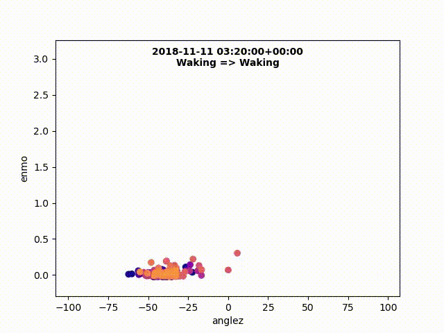

# Child Mind Sleep

## Steps to get started

1. Download the dataset from the [kaggle competetion](https://www.kaggle.com/competitions/child-mind-institute-detect-sleep-states/data)
2. Unzip the 4 files in a directory called data/
3. Run EAD.ipynb, and download any dependencies you might need.
4. 

## Steps to contribute

1. Pull the repo
2. Create a new branch from the branch you want to modify
3. Modify your branch
4. Push your branch and create a Pull request to merge your branch into main
5. 

## About this banch

In this branch I'm experimenting with different ways to visualize the acceleration data of a child to see if I'm able to see in the visualization when the child switches between waking and sleeping.

As of right now the focus series_id that I'm visualizing is `08db4255286f`

The notebook of interest here is [visualizer.ipynb](visualizer.ipynb) notebook. This is a recent visualization I produced on the data

